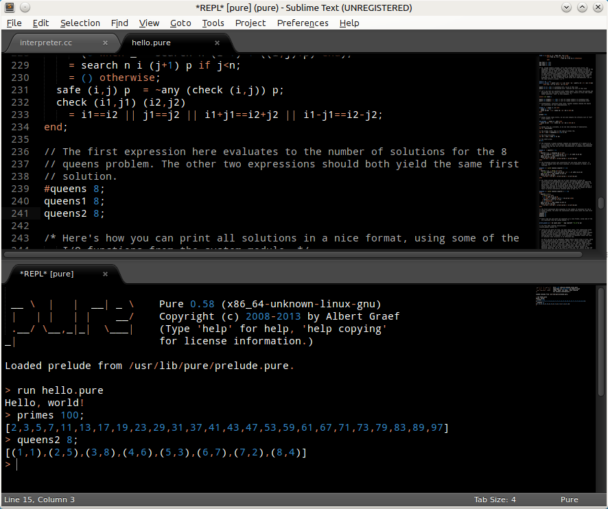

# Pure support for the Sublime Text editor

**Sublime Pure** is a [Pure][0] package for the [Sublime Text][1] editor based on Adam Sanderson's [TextMate bundle][2]. The package has been tested with both Sublime Text 2 and the current beta version of Sublime Text 3 (build 3047 at the time of this writing). It provides syntax highlighting for Pure scripts, a few snippets for Pure control flow constructs, and build commands for running scripts and batch-compiling them to executables. Basic support for the [SublimeREPL][6] extension is also available.

## Installation

This package can be installed via [Package Control][10]. The package is not in the official repository channel yet, however, so you'll have to add `https://github.com/agraef/sublime-pure.git` using Package Control's `Add Repository` command.

If you prefer to install manually, you can just grab this repository and drop its contents into the `sublime-pure` subdirectory in your Sublime Text [Packages][8] folder (create the directory if necessary).

Next time you open a script with the `.pure` extension, Sublime Text should properly highlight the script and provide you with commands to run and compile the script. You can also explicitly switch a buffer to Pure syntax using Sublime Text's `View | Syntax` menu.

To enable the [SublimeREPL][6] support, copy the `config/Pure` subdirectory in the repository into your `Packages/SublimeREPL/config` folder. This will allow you to run the Pure interpreter in a Sublime Text buffer. Please note that at present this step has to be done manually; there's no way to handle this through Package Control. Also note that this assumes that you already installed SublimeREPL beforehand (it's in the official package repositories).

## Usage

Please note that this package is still in its early stages, but syntax highlighting and auto-indentation work already. There are also some snippets for various Pure constructs (including lambdas, the `case`, `with` and `when` control structures as well as different kinds of declarations) which can be entered by typing the corresponding keyword and hitting the `Tab` key to auto- complete. In addition, you may find one of the available alignment extensions helpful to align a collection of Pure equations at the `=` sign. I found that Randy Lai's [AlignTab][3] plugin works best with Pure, YMMV.

You can adjust the indentation according to your preferences by creating a file named `Pure.sublime-settings` in your `Packages/User` directory. By default, Sublime Text uses real tabs with a tab size of 4. To change the tab size to 2 and expand tabs to spaces (so that the indentation looks the same if you later open the file with another text editor), you can use the following settings:

	{ "tab_size": 2, "translate_tabs_to_spaces": true }

The following build commands are defined by the package:

* `Build`: Compiles the current script to a native executable using the Pure batch compiler (`pure -c`).

* `Run`: Runs the script with the Pure interpreter (in batch mode).

* `Run in Terminal`: Runs the script in interactive mode (`pure -i`) inside a terminal window. (By default, the build command is configured to use `gnome-terminal`. You can change this by editing the [Pure.sublime-build][9] file accordingly.)

The `Build` and `Run` commands can be accessed as usual through Sublime Text's `Tool` menu and the corresponding keyboard shortcuts (`Ctrl+B` and `Ctrl+Shift+B` on Linux). The `Run in Terminal` command is available in Sublime Text's command palette (`Ctrl+Shift+P`, then search for `run`).

## SublimeREPL Support

As an alternative to `Run in Terminal`, you can also run the interpreter interactively in a Sublime Text buffer. This requires that you have [SublimeREPL][6] installed, along with the corresponding `config/Pure` directory in the Sublime Pure repository (see above).

Once installed, you can find the Pure REPL in the `Tools | SublimeREPL` menu as well as in the command palette (`Ctrl+Shift+P`, then search for `repl` and look for `SublimeREPL: Pure`). The interpreter starts up in the directory of the buffer which is active at the time the REPL is invoked. You can also run the interpreter with the current script loaded using the `Pure - run current file` option.

Here are some convenient keybindings which let you invoke the Pure REPL with `Ctrl+Super+P` and run a Pure script (if the current buffer is in Pure syntax mode) with `Ctrl+Super+R`. You can place these in your user keybindings file (`Preferences | Keybindings - User`):

	[
		{ "keys": ["ctrl+super+p"], "command": "run_existing_window_command",
		 "args": {"id": "repl_pure", "file": "config/Pure/Main.sublime-menu"} },
		{ "keys": ["ctrl+super+r"], "command": "run_existing_window_command",
		  "args": {"id": "repl_pure_run", "file": "config/Pure/Main.sublime-menu"},
		  "context": [{ "key": "selector", "operator": "equal", "operand": "source.pure" }] }
	]

SublimeREPL provides a command history as well as basic commands to feed lines, selections and entire scripts from a Pure buffer to the REPL. Please check the [SublimeREPL documentation][11] for further details. Various aspects of the plugin can be configured in the SublimeREPL settings file. Here's a useful setting which causes lines fed into the interpreter to be echoed in the REPL view:

	"show_transferred_text": true

SublimeREPL is not a complete terminal emulation, so the interpreter's ``help`` command won't work in it, since it uses a text-based browser (w3m) by default. You can make ``help`` work, however, if you set either the ``BROWSER`` or the ``PURE_HELP`` environment variable to a graphical browser application such as Firefox or Chrome. For instance, here's the SublimeREPL setting that I use on Ubuntu to set the help browser to Chromium:

	"default_extend_env": {"PURE_HELP": "chromium-browser"}

More information about the online help system of the Pure interpreter can be found in the [Pure manual][12].

## Support and Future Development

Please report bugs to the [issue tracker][4] or the [Pure mailing list][5].  Patches, comments and suggestions for improvements are welcome as well.

This package is still in its early stages. Possible directions for future development are better integration with [SublimeREPL][6] and [SublimeLinter][7] support. If you are a Sublime Text hacker who'd like to give a helping hand then we'd definitely like to hear from you!

## Acknowledgements

Thanks are due to Adam Sanderson for making his original Pure TextMate bundle available. Adam did all the hard work. I merely ported his bundle, updated it to the latest Pure syntax and added the usual bits and pieces needed to make the package play nicely with Sublime Text.

Enjoy. :)

Albert Gräf <aggraef at gmail.com>

[0]: https://agraef.github.io/pure-lang/
[1]: http://www.sublimetext.com/
[2]: http://endofline.wordpress.com/2009/09/03/textmate-bundle-for-pure/
[3]: https://github.com/randy3k/AlignTab
[4]: https://github.com/agraef/sublime-pure/issues
[5]: http://groups.google.com/group/pure-lang
[6]: https://github.com/wuub/SublimeREPL
[7]: https://github.com/SublimeLinter/SublimeLinter
[8]: http://docs.sublimetext.info/en/latest/basic_concepts.html#the-packages-directory
[9]: Pure.sublime-build
[10]: https://sublime.wbond.net/
[11]: http://sublimerepl.readthedocs.org/en/latest/
[12]: https://agraef.github.io/pure-docs/pure.html#online-help
